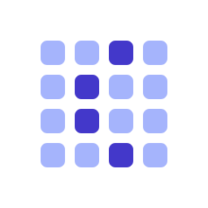
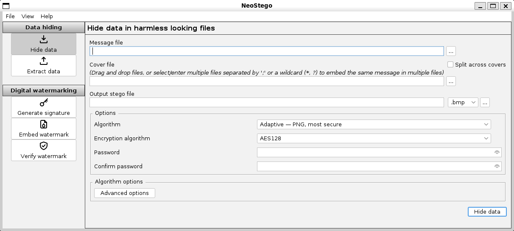

<div align="center">



# NeoStego

**Hide data inside images and audio, and watermark your files — on desktop and Android.**

[](https://github.com/ElCruncharino/neostego/releases/latest)
[](https://github.com/ElCruncharino/neostego/actions/workflows/gradle.yml)
[](LICENSE)
[](https://github.com/ElCruncharino/neostego/releases)

[](#download)
[](https://github.com/ElCruncharino/neostego/stargazers)

</div>

NeoStego does two things:

- **Data hiding** — conceal any file inside an image or audio file, optionally encrypted.
- **Watermarking** — embed an invisible, password-keyed signature to detect unauthorized copying.

It's a modernized fork of [OpenStego](https://www.openstego.com) by Samir Vaidya, adding strong
authenticated encryption, detection-resistant algorithms, runtime-bundled native installers, and a
new Android app — while staying [format-compatible](#compatibility-with-openstego) with OpenStego.

<p align="center">
  
  <br>
  <sub>The desktop app (light theme; a dark theme is also included).</sub>
</p>

## Download

Installers **bundle their own Java runtime** — there's nothing else to install.

| Platform | Get it |
| --- | --- |
| **Windows** | `winget install ElCruncharino.NeoStego` &nbsp;·&nbsp; or the [`.msi` installer](https://github.com/ElCruncharino/neostego/releases/latest) ¹ |
| **macOS** (Apple Silicon) | [`.dmg`](https://github.com/ElCruncharino/neostego/releases/latest) ¹ |
| **Linux** | [`.deb`](https://github.com/ElCruncharino/neostego/releases/latest) · [`.rpm`](https://github.com/ElCruncharino/neostego/releases/latest) · [portable `.zip`](https://github.com/ElCruncharino/neostego/releases/latest) |
| **Android** | [`.apk`](https://github.com/ElCruncharino/neostego/releases/latest) &nbsp;·&nbsp; or **[Obtainium](https://github.com/ImranR98/Obtainium)** for auto-updates: add an app with the URL `https://github.com/ElCruncharino/neostego` |

<sub>¹ Installers are currently unsigned: on macOS right-click → **Open** the first time; on Windows choose **More info → Run anyway** if SmartScreen prompts.</sub>

## Features

- 🔒 **Modern encryption** — PBKDF2-HMAC-SHA256 (random salt, high iteration count) + AES-GCM authenticated encryption. Older OpenStego data still decrypts automatically.
- 🖼️ **Detection-resistant hiding** — `RandomLSBMatch` (±1 LSB matching) defeats classic statistical steganalysis; `Adaptive` (HILL + Syndrome-Trellis Codes) concentrates changes in textured regions to resist modern, including CNN-based, detectors.
- 💧 **Robust watermarking** — `DWTSVD` embeds a real multi-bit payload, recovered **blindly**, that survives JPEG recompression, noise, blur, resampling, brightness changes, and small crops.
- 🎵 **Audio support** — hide data in uncompressed WAV (PCM) files.
- 🎨 **More formats** — read PNG/BMP/WebP covers, preserve embedded ICC color profiles, choose JPEG quality for watermarking.
- 🖥️ **Native desktop UX** — FlatLaf light/dark themes, native OS file dialogs, drag-and-drop, password reveal.
- 📱 **Android app** — a Kotlin / Jetpack Compose client sharing the same core engine.
- 🧩 **Full CLI** — scriptable `embed` / `extract` / watermarking commands.

> [!NOTE]
> Steganography hides data; it isn't magic invisibility. NeoStego raises the bar against detection
> but does not make embedding undetectable. See [How it works](#how-it-works) for the honest details.

## How it works

Each algorithm, the steganalysis benchmarks (BOSSbase / StegExpose / SRM / CNN), the watermark
robustness results, and the full academic citations are documented in
**[docs/ALGORITHMS.md](docs/ALGORITHMS.md)**.

## Compatibility with OpenStego

The on-disk steganography format is unchanged, so files created by older OpenStego versions remain
readable, and **unencrypted** NeoStego output round-trips with upstream OpenStego (regression tests
enforce this). The one exception: **newly encrypted** output uses AES-GCM and is *not* readable by
stock OpenStego — pass `--legacyencrypt` (CLI) to write the original format when you need interop.

## Usage

**GUI** — launch from the installed app's menu shortcut, or run the bundled `neostego` launcher from
the portable zip.

**CLI** — every function is scriptable:

```bash
neostego --help                  # list commands and options
neostego algorithms              # list available steganography algorithms
neostego embed   -mf secret.txt -cf cover.png -sf out.png -p <password>
neostego extract -sf out.png -xd ./out -p <password>
```

Commands: `embed`, `extract`, `gensig`, `embedmark`, `checkmark`, `algorithms`, `readformats`, `writeformats`.

## Building from source

Requires **JDK 21**. Common tasks:

```bash
./gradlew :desktop:jpackage      # native installer for the current OS (bundles a runtime)
./gradlew :desktop:distBin       # portable zip (needs a system Java to run)
./gradlew :android:assembleRelease   # Android APK (needs the Android SDK)
./gradlew test                   # run the test suite
```

The desktop installer task uses the OS it runs on (an MSI via WiX on Windows, `dmg` on macOS, `deb`/`rpm`
on Linux); CI builds all of them on a tag. The Android release build signs the APK when an
`android/keystore.properties` is present, and builds unsigned otherwise.

## Limitations

- **Save and share losslessly.** Hidden data lives in least-significant bits, so stego output must
  stay lossless (PNG for images, uncompressed WAV for audio). Re-encoding as JPEG/MP3 — including the
  recompression chat apps apply to "photos" — destroys the payload. Share as a *file*, not a photo.
- **Capacity scales with the cover.** Roughly one payload byte per ~3 image pixels (or ~8 audio
  samples); oversized payloads fail fast with a clear message. The content-adaptive algorithm trades
  capacity for security and holds less than plain LSB. The app shows usable capacity once a cover is selected.
- **Transparency is preserved, not used.** Alpha channels survive the round-trip; data is hidden only
  in RGB channels.

## Contributing

Issues and pull requests are welcome. The project is split into `core` (platform-independent
algorithms, crypto, plugin SPI), `desktop` (Swing GUI + CLI), and `android` (Compose app). Run
`./gradlew test` before submitting.

Optionally enable the local pre-push hook so a Kotlin formatting slip can't reach CI:

```sh
git config core.hooksPath .githooks
```

It runs `spotlessKotlinCheck` on push (`./gradlew spotlessKotlinApply` fixes any findings).

## License

NeoStego is a modified version of OpenStego, distributed under the **GNU General Public License,
version 2** (see [LICENSE](LICENSE)). Original copyright notices are retained, files changed in this
fork carry modification notices, and the complete corresponding source is this repository.

## Acknowledgements

- **OpenStego** by [Samir Vaidya](https://www.openstego.com) — the project NeoStego is forked from.
- The legacy spread-spectrum DWT watermarking plugins are based on code from **Peter Meerwald's**
  thesis on wavelet-domain watermarking (University of Salzburg, 2001).
- The modern data-hiding and steganalysis algorithms implement methods published by Jessica
  Fridrich's [**DDE Lab** at Binghamton University](https://dde.binghamton.edu/) and collaborators.
  NeoStego's implementations are **independent, clean-room implementations written from the published
  papers** — no DDE Lab source code is used or derived. Full citations are in
  [docs/ALGORITHMS.md](docs/ALGORITHMS.md).
- The **F5** plugin's algorithm core and Blake2b PRNG are lifted, near-verbatim, from
  [**Secret Space Encryptor (SSE)** by Paranoia Works](https://paranoiaworks.mobi) under the MIT
  License (the Blake2b digest is CC0 public domain); the F5 algorithm itself is due to Andreas
  Westfeld (2001). Unlike the DDE Lab plugins above, this is licensed reuse rather than clean-room —
  see [NOTICE](NOTICE) for the full attribution and license text.
